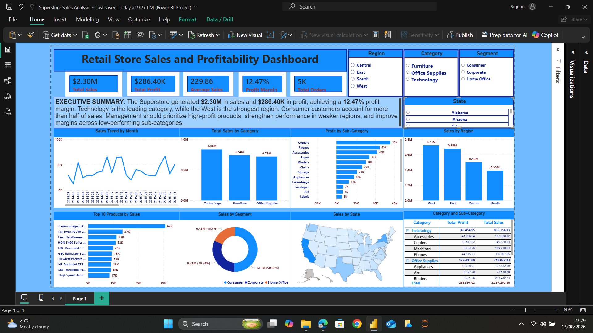

# 📊 Superstore Sales Analysis – Power BI Dashboard

## 📌 Project Overview

This project presents an interactive **Business Intelligence dashboard developed using Microsoft Power BI** to analyze the Superstore Sales dataset.

The analysis focuses on:

- Sales performance
- Profitability
- Product categories
- Customer segments
- Regional performance
- Sales trends over time
- Geographical sales distribution

The dashboard was designed to transform raw sales data into meaningful business insights that can support data-driven decision-making.

---

## 🎯 Business Objectives

The project aims to answer key business questions such as:

- What is the overall sales and profit performance?
- Which product categories generate the highest sales?
- Which customer segments contribute most to revenue?
- Which regions perform best?
- How do sales change over time?
- Which products contribute most to sales?
- Where are there opportunities to improve profitability?

---

## 📈 Key Performance Indicators

| KPI | Value |
|---|---:|
| **Total Sales** | **$2.30M** |
| **Total Profit** | **$286.40K** |
| **Average Order Value** | **$229.86** |
| **Profit Margin** | **12.47%** |
| **Total Orders** | **5K** |

---

## 📊 Dashboard



The dashboard provides an interactive view of sales performance using KPI cards, charts, filters and visual analysis.

Users can explore the data by:

- Region
- Category
- Segment
- State
- Product performance
- Time period

---

## 🔍 Key Business Insights

### 1. Strong overall revenue performance

The Superstore generated approximately **$2.30 million in total sales** and **$286.40K in total profit**, resulting in an overall **12.47% profit margin**.

This indicates strong revenue generation, while also highlighting the need to monitor profitability alongside sales growth.

### 2. Technology is the leading product category

**Technology** is the strongest-performing category, generating approximately **$0.84M in sales**, compared with approximately **$0.74M for Furniture** and **$0.72M for Office Supplies**.

Technology should therefore remain a strategic focus for revenue growth.

### 3. The West region leads regional sales

The **West region** records the highest sales at approximately **$0.73M**, followed by the **East at approximately $0.69M**.

The **South region is the weakest-performing region**, with sales of approximately **$0.51M**.

This regional variation suggests an opportunity to investigate the factors behind the stronger performance of the West and East.

### 4. Consumer customers contribute more than half of total sales

The **Consumer segment contributes more than half of total sales**, making it the most important customer segment in the dashboard.

This creates both an opportunity and a risk: retaining Consumer customers is important, but excessive dependence on one segment could expose the business to changes in consumer demand.

### 5. Profitability varies significantly across product sub-categories

The profit-by-sub-category analysis shows substantial differences in profitability.

**Copiers and Phones** are among the strongest profit-generating sub-categories, while some sub-categories such as **Tables** show significantly weaker profitability.

This indicates that management should evaluate product-level margins rather than focusing only on total sales.

---

## ⚠️ Business Risks

### 1. Customer segment concentration

The Consumer segment contributes more than half of total sales. A significant decline in Consumer demand could therefore have a noticeable impact on overall revenue.

### 2. Regional performance imbalance

The South region performs considerably below the West and East regions. Continued underperformance could limit the company's overall growth potential.

### 3. Profitability pressure

The overall profit margin is **12.47%**, meaning that a relatively large portion of revenue is consumed by costs. Low-profit sub-categories may further reduce overall profitability.

---

## 💡 Business Opportunities

### 1. Expand Technology sales

Technology is the strongest sales category. The business could increase investment in high-performing Technology products, promotions and inventory.

### 2. Improve South regional performance

The business can investigate pricing, product availability, customer preferences and marketing strategies in the South region to identify why sales are lower.

### 3. Optimize product portfolio

Management can focus resources on high-profit sub-categories while reviewing low-profit products for pricing, discounting and cost optimization.

---

## 🎯 Business Recommendations

1. **Increase investment in Technology products** because Technology currently generates the highest category sales.

2. **Develop a targeted strategy for the South region** by investigating customer preferences, product availability and marketing effectiveness.

3. **Protect the Consumer customer base** through loyalty programs, personalized promotions and targeted customer engagement.

4. **Review low-profit sub-categories** and assess pricing, discounts, shipping costs and product costs to improve margins.

5. **Prioritize profitable products rather than sales volume alone** by using both sales and profit KPIs when making inventory and marketing decisions.

6. **Monitor regional and segment performance regularly** using the Power BI dashboard to identify emerging changes early.

7. **Replicate successful strategies from high-performing regions** such as the West and East in weaker regions where appropriate.

---

## 📌 Project Outcome

The Power BI dashboard transforms the Superstore sales dataset into an interactive business intelligence solution.

The analysis provides management with visibility into:

- Revenue performance
- Profitability
- Category performance
- Regional sales
- Customer segments
- Product profitability
- Sales trends

These insights can support more informed decisions around **product strategy, customer retention, regional expansion and profitability improvement**.

---

## 🛠️ Tools & Technologies

- **Microsoft Power BI**
- **Power Query**
- **DAX**
- **Microsoft Excel**
- **GitHub**

---

## 🔄 Data Analysis Process

The project followed a typical data analytics workflow:

```text
Raw Dataset
     ↓
Data Cleaning & Transformation
     ↓
Data Modeling
     ↓
DAX Measures
     ↓
Data Visualization
     ↓
Interactive Dashboard
     ↓
Business Insights & Recommendations

📂 Project Structure

superstore-sales-powerBI/
│
├── Superstore Sales Analysis.pbip
│
├── Superstore Sales Analysis.Report/
│
├── Superstore Sales Analysis.SemanticModel/
│
├── screenshots/
│ └── dashboard.png
│
└── README.md

The repository contains the Power BI Project (PBIP) files, including the report and semantic model.

📌 Key Skills Demonstrated
Data cleaning and transformation
Data modeling
DAX calculations
KPI development
Data visualization
Business intelligence
Dashboard design
Business analysis
GitHub project management


👨‍💻 Author
Emyvon-dot
Data Analyst | Power BI | Excel | SQL | Python
